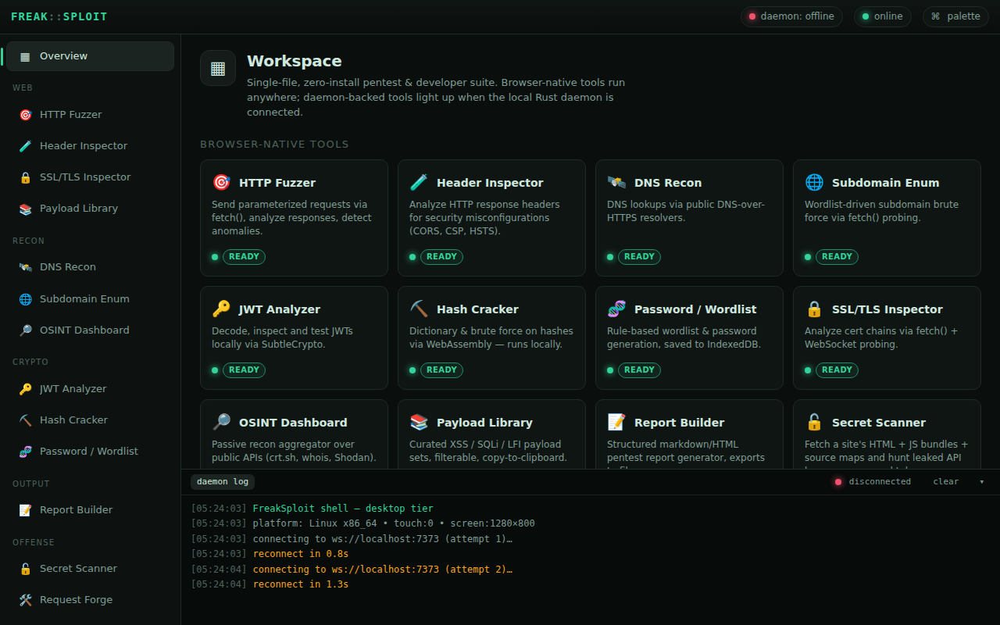
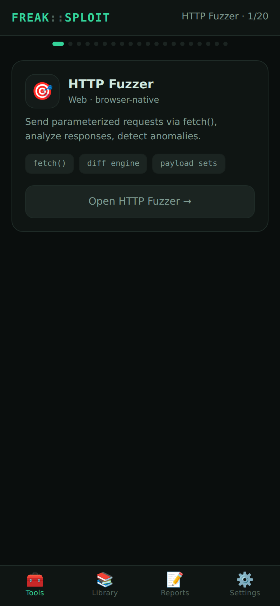

# FreakSploit

A single-file, zero-install, browser-based developer & pentesting suite. The
page itself is always the UI — drop `index.html` on GitHub Pages (or any static
CDN) and it runs. No build step, no bundler, no npm, no server-side compute.

## Screenshots

| Desktop (multi-pane IDE) | iOS (swipe + tabs) |
|---|---|
|  |  |

## Status — Functional suite

The shell **and all 18 tools** are implemented. Browser-native tools run on
desktop and iOS; daemon tools render full protocol UIs that activate when the
WebSocket is connected. Verified with a headless Playwright smoke test
(`test/smoke.mjs`): both layouts mount with no runtime errors, all 19 routes
render, and the word "daemon" never appears anywhere in the iOS build.

### Tools

**Browser-native (desktop + iOS):** JWT Analyzer (decode + HS verify),
Header Inspector (security grading), DNS Recon (DoH), HTTP Fuzzer (FUZZ +
anomaly detection), Subdomain Enumerator (DoH brute force), Password/Wordlist
Builder (mutations + IndexedDB), Payload Library (curated + custom), Hash
Cracker (MD5/SHA dictionary + brute force), SSL/TLS Inspector (crt.sh + probe),
OSINT Dashboard (crt.sh + DNS), Report Builder (markdown/HTML export).

**Offense — active testing (desktop + iOS):** for finding common
"vibe-coded" bugs in *your own* apps from any device, all at the
HTTP/WebSocket layer (no native deps):
- **Secret Scanner** — fetch HTML + JS bundles + source maps, hunt leaked
  API keys / env vars / tokens (the #1 client-shipped-secrets mistake)
- **Request Forge** — build/tamper/replay any HTTP request, import from cURL
- **WebSocket Workbench** — live frame sniff + inject + fuzz (real, in-browser)
- **Auth / Token Lab** — forge JWTs (alg:none, role→admin, resign) and replay
  them against an endpoint to test signature/claim validation
- **Param / Price Tamper** — auto-mutate price/qty/role/id and flag when the
  server trusts client values (broken object-level authz / mass assignment)
- **Injection Tester** — SQLi/NoSQLi/SSTI/cmd with error, time-based and
  reflection detection
- **IDOR / Access Probe** — enumerate neighbouring object IDs and diff
  authed vs unauthed responses (broken object-level authorization)
- **CORS Tester** — behavioural detection of exploitable CORS (wildcard,
  reflected origin, credentialed cross-origin reads)
- **API / Endpoint Discovery** — probe for exposed `.env` / `.git`, source
  maps, swagger/OpenAPI and GraphQL introspection

> **Boundary:** raw L2/L3 packet capture/injection (pcap, ARP, monitor mode)
> is impossible from a browser and lives in the desktop daemon tier. The iOS
> Offense tools operate at the application layer — which is where most
> vibe-coded vulnerabilities actually are. Cross-origin tools route through
> the optional CORS proxy configured in Settings.

> ⚠️ **Only test systems you own or are authorized to test.**

**Daemon-connected (desktop only):** Network Scanner, Packet Analyzer, HTTP
Interceptor, Interface Manager, Raw Packet Injector, Exploit Console, Remote
Daemon Connector.

### Shell foundation

1. **Platform detection & capability tiers** — `navigator.userAgent`,
   `maxTouchPoints`, screen dimensions and `connection` decide the tier.
   iPadOS-as-desktop spoofing is handled. Force a tier for testing with
   `?mode=ios` or `?mode=desktop`.
2. **Two layout systems**
   - **Desktop tier** (Mac/Windows/Linux/Android) — multi-pane IDE layout:
     sidebar nav, dense main view, integrated terminal/daemon-log panel,
     keyboard navigation (`j`/`k`/arrows, `g` → overview).
   - **iOS tier** (iPhone/iPad) — single-column, card-based, thumb-friendly
     (44px+ targets), horizontal scroll-snap swipe pager + bottom tab bar.
     **Zero mention of the daemon anywhere** — iOS never sees daemon UI or
     "unavailable" states.
3. **Tool routing** — hash-based router; data-driven tool registry.
4. **Daemon WebSocket manager** — `ws://localhost:7373`, JSON messaging,
   exponential-backoff reconnect, live status indicator (topbar + terminal),
   manual retry. Desktop-only; never instantiated on iOS.
5. **Stub tool cards** for every tool in both modes.

### Capability tiers

- **Browser-native tools** (both tiers): HTTP Fuzzer, Header Inspector, DNS
  Recon, Subdomain Enumerator, JWT Analyzer, Hash Cracker, Password/Wordlist
  Builder, SSL/TLS Inspector, OSINT Dashboard, Payload Library, Report Builder.
- **Daemon-connected tools** (desktop only, degrade to a "connect daemon"
  gate when offline): Packet Analyzer, Network Scanner, HTTP Interceptor,
  Exploit Console, Interface Manager, Raw Packet Injector, Remote Daemon
  Connector.

Color language: **green** = available, **amber** = daemon required but missing,
iOS-unavailable tools are never rendered.

## Architecture notes

- **Single HTML file** — all CSS/JS inline. No frameworks; vanilla JS only.
- **Conditional desktop modules** — desktop-only tool factories are only
  invoked in the desktop tier, so the iOS path never loads daemon logic.
- **IndexedDB** for all persistence (settings, wordlists, history, reports,
  tool state).
- **Service worker** (registered from a Blob URL to stay single-file) caches
  the app shell for offline use; tools degrade gracefully.
- The **Rust daemon** is a separate project and is intentionally not scaffolded
  here. The app assumes it exposes `ws://localhost:7373` with JSON messaging.

## Run locally

Just open `index.html`, or serve the directory:

```sh
python3 -m http.server 8080   # then visit http://localhost:8080
```

A static server is recommended so the service worker can register.
