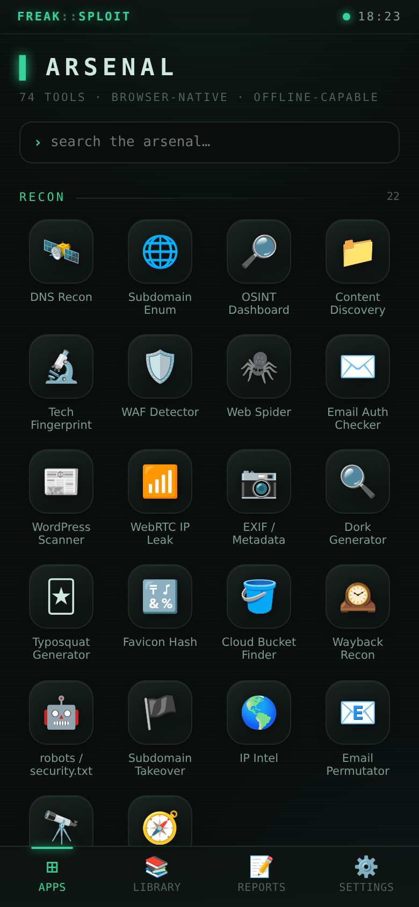

# FreakSploit

A single-file, zero-install, browser-based developer & pentesting suite. The
page itself is always the UI — drop `index.html` on GitHub Pages (or any static
CDN) and it runs. No build step, no bundler, no npm, no server-side compute.

## Screenshots

| Desktop (multi-pane IDE) | iOS (swipe + tabs) |
|---|---|
|  |  |

## Status — Functional suite

The shell **and all 77 tools** (70 universal + 7 daemon-only) are implemented. Browser-native tools run on
desktop and iOS; daemon tools render full protocol UIs that activate when the
WebSocket is connected. Verified with a headless Playwright smoke test
(`test/smoke.mjs`): both layouts mount with no runtime errors, all routes render, and the word "daemon" never appears anywhere in the iOS build.

### Tools — 74 universal (iOS + desktop) + 7 daemon-only

**Recon** (22)

- 🛰️ **DNS Recon** — DNS lookups via public DNS-over-HTTPS resolvers.
- 🌐 **Subdomain Enum** — Wordlist-driven subdomain brute force via fetch() probing.
- 🔎 **OSINT Dashboard** — Passive recon aggregator over public APIs (crt.sh, whois, Shodan).
- 📁 **Content Discovery** — Directory & file brute force (gobuster/ffuf-style) with extensions, soft-404 filtering and concurrency.
- 🔬 **Tech Fingerprint** — Identify server, frameworks, CMS and JS libraries from headers, HTML and script signatures (Wappalyzer-style).
- 🛡️ **WAF Detector** — Fingerprint web application firewalls (Cloudflare, Akamai, Imperva, Sucuri, AWS, ModSecurity…) from headers, status and block-page signatures.
- 🕷️ **Web Spider** — Crawl a page for links, forms, scripts, comments, emails and in-script API endpoints; optional one-hop same-origin crawl.
- ✉️ **Email Auth Checker** — Audit a domain's SPF, DMARC and DKIM records over DNS-over-HTTPS and flag spoofable policies.
- 📰 **WordPress Scanner** — Detect WordPress, enumerate users via the REST API, read the version and list plugins/themes.
- 📶 **WebRTC IP Leak** — Discover local/public IP addresses leaked by the browser via WebRTC ICE candidates.
- 📷 **EXIF / Metadata** — Read EXIF metadata (camera, timestamps, GPS) from a JPEG you pick — fully offline.
- 🔍 **Dork Generator** — Build Google dork queries for a target — exposed files, login pages, directory listings and secrets.
- 🃏 **Typosquat Generator** — Generate domain permutations (typos, homoglyphs, TLD swaps, bitsquats) and DNS-check which are registered.
- 🔣 **Favicon Hash** — Compute the MurmurHash3 favicon hash Shodan uses to fingerprint and find related hosts.
- 🪣 **Cloud Bucket Finder** — Hunt for public S3/GCS/Azure buckets from a keyword and flag listable or access-denied storage.
- 🕰️ **Wayback Recon** — Pull a domain's historical URLs from the Wayback Machine CDX API and surface juicy paths and parameters.
- 🤖 **robots / security.txt** — Fetch and parse robots.txt, security.txt and sitemap.xml — disallowed paths often reveal hidden endpoints.
- 🏴 **Subdomain Takeover** — Resolve a host's CNAME and fingerprint dangling cloud services (GitHub Pages, S3, Heroku, Azure…) for takeover.
- 🌎 **IP Intel** — Resolve a host, reverse-DNS (PTR) and pull geolocation/ASN/ISP for an IP.
- 📧 **Email Permutator** — Generate likely corporate email address formats from a name and domain for OSINT.
- 🔭 **Shodan / Censys Query** — Build Shodan and Censys search queries from a target with facet chips (port, org, product, cert).
- 🧭 **User-Agent Parser** — Parse a User-Agent string into browser, engine, OS, device and bot indicators.

**Web** (10)

- 🎯 **HTTP Fuzzer** — Send parameterized requests via fetch(), analyze responses, detect anomalies.
- 🧪 **Header Inspector** — Analyze HTTP response headers for security misconfigurations (CORS, CSP, HSTS).
- 🔒 **SSL/TLS Inspector** — Analyze cert chains via fetch() + WebSocket probing.
- 📚 **Payload Library** — Curated XSS / SQLi / LFI payload sets, filterable, copy-to-clipboard.
- 🧱 **CSP Auditor** — Fetch or paste a Content-Security-Policy and grade it — unsafe-inline/eval, wildcards, missing directives.
- 🍪 **Cookie Analyzer** — Audit Set-Cookie headers for Secure, HttpOnly, SameSite, scope and __Host-/__Secure- prefix compliance.
- ⚠️ **Mixed Content Scanner** — Find insecure http:// resources loaded by an https:// page (scripts, styles, images, forms).
- 🔗 **SRI Checker** — Find cross-origin scripts and styles loaded without Subresource Integrity — a supply-chain risk.
- 🛤️ **HSTS Checker** — Inspect Strict-Transport-Security — max-age, includeSubDomains, preload eligibility.
- 📑 **URL Analyzer** — Break a URL into components, decode every query parameter and auto-decode embedded JWT/base64 values.

**Offense** (26)

- 🔓 **Secret Scanner** — Fetch a site's HTML + JS bundles + source maps and hunt leaked API keys, env vars and tokens.
- 🛠️ **Request Forge** — Build, tamper and replay any HTTP request; import from cURL; inspect responses (repeater).
- 📨 **WebSocket Workbench** — Connect to a WebSocket endpoint to sniff live frames and inject or fuzz crafted messages.
- 🪪 **Auth / Token Lab** — Forge & tamper JWTs (alg:none, role→admin, resign), inject into requests and compare access.
- 🏷️ **Param / Price Tamper** — Auto-mutate price, quantity, role and id fields, replay, and flag when the server trusts client values.
- 🧨 **Injection Tester** — Probe params for SQLi / NoSQLi / SSTI / command injection with error, boolean, time-based and reflection detection.
- 🎫 **IDOR / Access Probe** — Enumerate neighbouring object IDs and compare authed vs unauthed responses to find broken access control.
- 🌍 **CORS Tester** — Detect exploitable CORS misconfigurations — wildcard, reflected origin and credentialed cross-origin access.
- 🗝️ **API / Endpoint Discovery** — Probe for exposed sensitive paths — .env, .git, source maps, swagger/OpenAPI and GraphQL introspection.
- 🪝 **Param Miner** — Discover hidden GET/POST parameters (Arjun-style) via reflection and response-diff detection.
- ↪️ **Open Redirect Scanner** — Test redirect parameters for open-redirect to attacker domains via Location, meta and JS sinks.
- 🖼️ **Clickjacking Tester** — Check X-Frame-Options / CSP frame-ancestors and prove framability with a live iframe PoC.
- 🎭 **CSRF PoC Builder** — Generate an auto-submitting HTML or fetch() proof-of-concept from any request.
- 🐚 **Reverse Shell Generator** — Generate reverse-shell one-liners (bash, python, php, nc, powershell…) with LHOST/LPORT and encoding.
- ◈ **GraphQL Lab** — Run GraphQL introspection, enumerate queries/mutations/types and execute ad-hoc queries.
- 🛰️ **SSRF Probe** — Test URL parameters for SSRF with cloud-metadata and internal targets plus an out-of-band canary for blind detection.
- 🎟️ **JWT Attack Lab** — Generate JWT attack tokens: alg:none, kid path/SQLi injection, RS256→HS256 algorithm confusion and jku/x5u hijack.
- 🔁 **HTTP Methods Tester** — Probe which HTTP verbs an endpoint accepts (PUT/DELETE/PATCH/OPTIONS) to find dangerous or misconfigured methods.
- 🚧 **403 Bypass Tester** — Attempt access-control bypass on a forbidden path via path tricks and header overrides (X-Original-URL, X-Forwarded-For…).
- ☣️ **Prototype Pollution Scanner** — Statically scan a site's JS for prototype-pollution sinks (deep merge, __proto__) and known-vulnerable library versions.
- 🗄️ **Cache Poisoning Probe** — Inject unkeyed headers (X-Forwarded-Host/Scheme) and detect reflection — a web cache poisoning indicator.
- 📜 **XXE Helper** — Generate XXE payloads (file read, SSRF, OOB exfil, parameter entities) and send test XML to an endpoint.
- 🧩 **SSTI Builder** — Per-engine server-side template injection probes (Jinja2, Twig, Freemarker, ERB, Velocity…) and a polyglot.
- 📂 **Path Traversal / LFI** — Test a parameter for path traversal / local file inclusion with layered encodings and file-content signatures.
- ↵ **CRLF Injection** — Inject CRLF sequences into a parameter and detect header/response splitting via reflected markers.
- ⏱️ **Rate / Load Tester** — Fire a burst of concurrent requests to measure rate limiting, status distribution and latency percentiles.

**Crypto** (15)

- 🔑 **JWT Analyzer** — Decode, inspect and test JWTs locally via SubtleCrypto.
- ⛏️ **Hash Cracker** — Dictionary & brute force on hashes via WebAssembly — runs locally.
- 🧬 **Password / Wordlist** — Rule-based wordlist & password generation, saved to IndexedDB.
- 🔐 **Crypto Lab** — CyberChef-style encode/decode, hashing, HMAC, AES-GCM, hash identification and entropy analysis.
- 🧮 **Dev Utilities** — Epoch↔date, UUID generate/inspect, base converter and a live regex tester.
- 🧷 **JWKS Inspector** — Fetch and parse a JWKS endpoint — list keys with kid/alg/use and compute RFC7638 thumbprints.
- 🔥 **Pwned Password** — Check a password against Have I Been Pwned using k-anonymity — the password never leaves your device.
- 💪 **Password Strength** — Estimate password entropy and crack time, and flag weak patterns — fully offline.
- 🔨 **JWT Secret Cracker** — Dictionary-attack an HS256/384/512 JWT to recover the signing secret locally via SubtleCrypto.
- 📐 **Subnet Calculator** — Compute network, broadcast, mask, host range and count from CIDR — fully offline.
- 📦 **File Type ID** — Identify a file's true type from its magic bytes — spot mismatched extensions, offline.
- 🧾 **JSON Tools** — Format, minify, validate and escape/unescape JSON with precise error locations.
- #️⃣ **File Hasher** — Compute SHA-1/256/512 of a picked file for integrity or IOC checks — fully offline.
- 🔀 **Diff Tool** — Line-level diff of two texts or HTTP responses (Burp-comparer style), highlighting additions and removals.
- 📃 **SAML Decoder** — Decode SAML (base64 + optional DEFLATE), pretty-print the XML and extract issuer, NameID, attributes and validity.

**Output** (1)

- 📝 **Report Builder** — Structured markdown/HTML pentest report generator, exports to file.

**Daemon-connected** (desktop only, require the local Rust daemon)

- 📡 **Packet Analyzer** — Wireshark-style live capture fed by raw pcap stream over WebSocket, with protocol dissection + BPF filters.
- 🗺️ **Network Scanner** — nmap frontend — sends scan configs to daemon /exec, renders results.
- 🕸️ **HTTP Interceptor** — Burp-style intercepting proxy; daemon intercepts, browser renders req/res editor.
- 💥 **Exploit Console** — Metasploit-style console backed by a daemon-managed v86/CheerpX Linux runtime.
- 🔌 **Interface Manager** — Enumerate NICs, toggle monitor mode via daemon /interfaces.
- 💉 **Raw Packet Injector** — Craft & inject custom packets via daemon /inject.
- 🛜 **Remote Daemon Connector** — Pair with a daemon on another LAN device or over a tunnel.

### Shell foundation

1. **Platform detection & capability tiers** — `navigator.userAgent`,
   `maxTouchPoints`, screen dimensions and `connection` decide the tier.
   iPadOS-as-desktop spoofing is handled. Force a tier for testing with
   `?mode=ios` or `?mode=desktop`.
2. **Two layout systems**
   - **Desktop tier** (Mac/Windows/Linux/Android) — multi-pane IDE layout:
     sidebar nav, dense main view, integrated terminal/daemon-log panel,
     keyboard navigation (`j`/`k`/arrows, `g` → overview).
   - **iOS tier** (iPhone/iPad) — single-column, card-based, thumb-friendly
     (44px+ targets), horizontal scroll-snap swipe pager + bottom tab bar.
     **Zero mention of the daemon anywhere** — iOS never sees daemon UI or
     "unavailable" states.
3. **Tool routing** — hash-based router; data-driven tool registry.
4. **Daemon WebSocket manager** — `ws://localhost:7373`, JSON messaging,
   exponential-backoff reconnect, live status indicator (topbar + terminal),
   manual retry. Desktop-only; never instantiated on iOS.
5. **Stub tool cards** for every tool in both modes.

### Capability tiers

- **Browser-native tools** (both tiers): HTTP Fuzzer, Header Inspector, DNS
  Recon, Subdomain Enumerator, JWT Analyzer, Hash Cracker, Password/Wordlist
  Builder, SSL/TLS Inspector, OSINT Dashboard, Payload Library, Report Builder.
- **Daemon-connected tools** (desktop only, degrade to a "connect daemon"
  gate when offline): Packet Analyzer, Network Scanner, HTTP Interceptor,
  Exploit Console, Interface Manager, Raw Packet Injector, Remote Daemon
  Connector.

Color language: **green** = available, **amber** = daemon required but missing,
iOS-unavailable tools are never rendered.

## Architecture notes

- **Single HTML file** — all CSS/JS inline. No frameworks; vanilla JS only.
- **Conditional desktop modules** — desktop-only tool factories are only
  invoked in the desktop tier, so the iOS path never loads daemon logic.
- **IndexedDB** for all persistence (settings, wordlists, history, reports,
  tool state).
- **Service worker** (registered from a Blob URL to stay single-file) caches
  the app shell for offline use; tools degrade gracefully.
- The **Rust daemon** is a separate project and is intentionally not scaffolded
  here. The app assumes it exposes `ws://localhost:7373` with JSON messaging.

## Run locally

Just open `index.html`, or serve the directory:

```sh
python3 -m http.server 8080   # then visit http://localhost:8080
```

A static server is recommended so the service worker can register.
